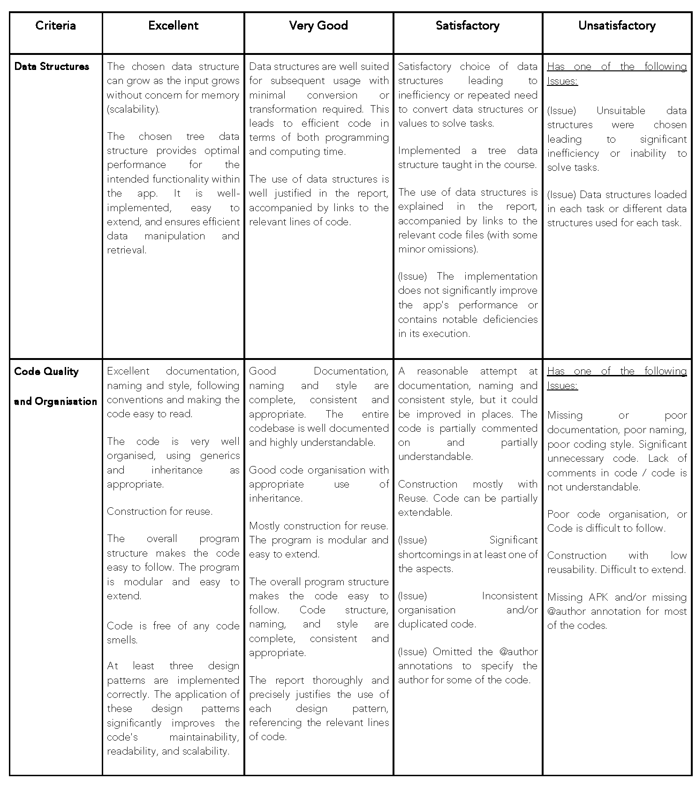
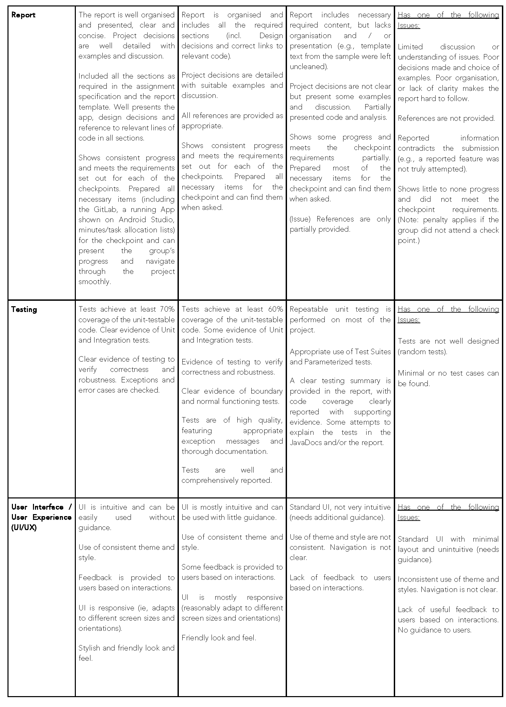
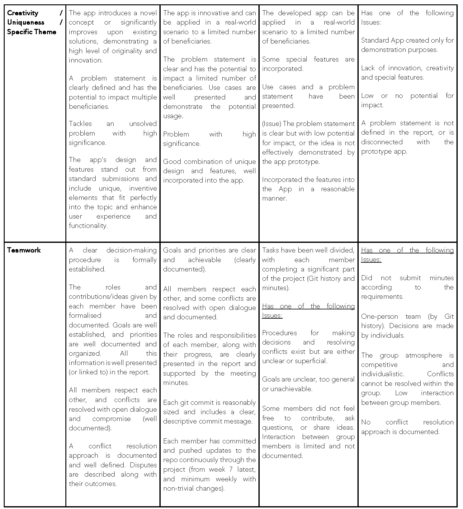
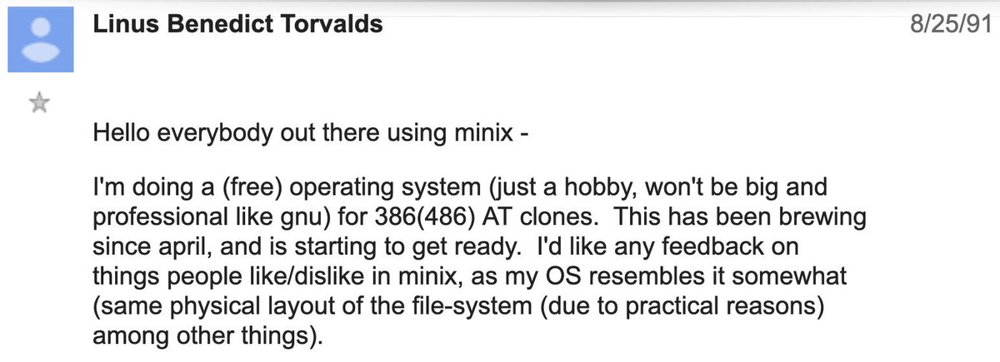

# Appendices

## Assessment and General Policies

### Submission policy

**No extension will be granted for this assignment, and no late submissions will be accepted.**

Given that the project spans over 7 weeks, it is expected that every group will plan their work in such a way that a passable version of the project is completed well ahead of the deadline. This also includes **contingency planning** to manage minor, unexpected events, such as illness within the group, ensuring these do not derail your progress. Your project state as of the deadline will be forked and assessed, with no submissions or updates permitted beyond this point.

If you have an active EAP, you may reach out to the conveners to explore possible adjustments in the assignment. You must inform the conveners by the start of Week 7 (Monday, Week 7). Note that extensions are not granted for Group Assignments.

### Originality

The project must be your own original work. If you make use of any code that is not your own, it must be clearly referenced. This can be done by adding a simple comment next to the code stating where you obtained the code from as well as in the **statement of originality**. This is especially important, as any breach of this needs to be investigated and reported. You are much better off not doing this project than copying a small part of code and risking academic misconduct. Remember, we are assessing your code, not someone else’s code.

Every person in the group is responsible for the originality of every part of the project (regardless of who wrote or contributed to it). Any violation of the [academic honesty and plagiarism policy](https://www.anu.edu.au/students/academic-skills/academic-integrity) will result in the entire group receiving the mark of zero for the group project.

*Any images or other assets that you copy from the Web must be attributed (e.g., from splash.com). This must be added to your statement of originality. Ideally, you should only use assets that you have the right to copy, such as ones you create yourself, are in the public domain, or under a Creative Commons License. With the statement of originality, you are safe and will be assessed only based on work done by you and your group.

### Marking Criteria

Marks will be based on several criteria (check **[rubrics](#assessment-rubrics)** and other requirements in the specification). The indicative mark for each criterion in determining the final grade is displayed as follows.

> **Final Group Project (FGP) (out of 30 marks) =**
>
> Basic (6) + Custom (6) + Testing (4) + Report (6) + Teamwork (2) + Creativity (2) + UI/UX (2) + Submission (2) - Penalties

Apart from marks calculation using the indicative formula presented above, violations of the requirements or rules for assignment submissions result in additional penalties, and the magnitude depends on the severity. Note that an incomplete submission may lead to more deductions in the relevant parts on top of the indicative marks for `Submission`.

**In addition to the rubrics (and out of 30)**:
- Failure to specify the API level for your target and compile SDK will incur a penalty of 3 marks.
- Deviations from any requirements in the project specification, without prior written approval, will result in a penalty of 3 marks. Failure to include the written approval in the report will also result in a 3-mark penalty.
- Failure to provide accounts for markers' access to your app, as described in the report, will result in a penalty of 3 marks.
- Failure to include data files or links to the data used in your app (e.g., Firebase, including authentication and URL information) in your report will result in a penalty of 3 marks.
- Implementation of features without proper and justified use of the concepts taught in the course (and relevant previous courses) may incur a penalty of 10 marks.
- Implementing more or fewer features than required (both basic and custom) will result in a penalty of 10 marks.
- The use of third-party solutions without proper declaration will result in a score of zero for the assignment.
- Failure to implement the surprise feature will result in a penalty of 3 marks.
- Missing a checkpoint will result in a penalty of 5 marks.
- Updating any file or information after the deadline will incur a 100% penalty.
- Lack of continuous commits will result in a penalty of 4 marks per week for non-meaningful code pushes. All team members must push code unless a documented exception is made in the meeting minutes prior to the week (planned).
- Failure to accurately complete the statement-of-originality.yml file will result in zero marks.
- Failure to provide meeting minutes will result in a penalty of 10 marks.
- Failure to submit all required files will result in a penalty of 15 marks.
- Reporting unimplemented features will incur a penalty of 15 marks and may lead to an academic integrity investigation.
- Using an account other than your ANU account (UID) to push code will result in a penalty of 3 marks per push.
- Failure to generate or submit a working APK will result in a penalty of 5 marks.
- Failure to submit a video of the app will result in a penalty of 5 marks.
- Large commits/pushes will incur a penalty of 5 marks each.
- Failure to submit the individual reflection will result in a penalty of 5 marks. Incorrect UIDs for team members or yourself will incur an additional penalty of 5 marks.

### Individual Contribution

You will be assessed individually and as part of the group. You must make sure that the work is divided up so everyone can undertake some coding and contribute to the overall project. Marks will be reduced for members who contributed much less than others, and for the group for poor group management (remember, this is a group project, and you must work as a team and collaborate effectively).

Note that **each group** is expected to contribute approx. 60 hours for
this project. The group marks **DOES NOT** default to be the same for each
member. Group members who contributed much less than others will receive
an extra [5,80] % penalty. Members who did not effectively contribute
will receive zero marks.

Each member must implement and commit a non-trivial amount of code (**will be checked**!). Specifically, this entails being the key author for at least **TWO features** (Basic and/or Custom), on top of having contributed to other tasks such as **report, meetings, presentation, testing**, etc.

We also expect you to commit (reasonable amounts of code) frequently (e.g., **every week from week 7** (ideally from teaching-break). Last-minute commits and lines implemented are not expected in large projects and, therefore, marks will be deducted for poor project and time management. We have assessed hundreds of projects before, and we know that those who start early finish early and deliver a better product. This is our way to help you do better :)

The individual contributions must be in the **report** and reflected in the
**meeting minutes** (tasks assigned and completed by each member), as well
as reflected in the <u>**Git commit history**</u>. Peer and self-evaluation
must be submitted to Wattle by **each** group member. This should be done
independently (do not discuss it with your teammates – make your own
fair judgment and justify the same) and only examiners have access to
the individual reflections.

### Best Practices for Using Generative AI Tools for Software Construction

Generative AI tools, such as ChatGPT and Co-pilot, offer immense value
to software developers and can significantly enhance their efficiency.
These tools have shown the ability to generate code snippets, suggest
improvements, and provide contextual guidance, thereby simplifying the
coding process and reducing the time and effort required to complete
some tasks. By leveraging these AI-based tools, we expect you to focus
more on designing and refining your software rather than spending
valuable time on mechanical tasks automated by AI tools.

Note that you and your group are responsible for any output generated by
AI tools used to complete your group assignment. It is also mandatory to
explicitly acknowledge where and how these generative AI tools were used
to assist in completing the assignment. Failing to acknowledge the use
of these tools is a violation of academic integrity rules.

#### Important:

1. Any output generated by Gen AI tools in your assignment must be
   explicitly acknowledged and attributed to the individuals or the whole
   group for using them. This includes any pieces of code, comments, text,
   or other content created with the assistance of Gen AI tools. Gen AI
   tools cannot be listed as authors, as they are not accountable for their
   outputs.

2. The explicit acknowledgement must be given wherever these outputs
   are used in your assignment and also in the statement of originality
   file. Explain how Gen AI tools were used, as well as the proportion of
   the work done by each member and the AI tools.

3. Gen AI tools can be used in a variety of tasks, including debugging,
   documentation and commenting, and assisting with other writing and
   coding tasks. These tools can help to streamline the coding process,
   improve code quality, and increase overall efficiency. However, the
   output generated by these tools should be critically assessed as they
   are not always accurate. It is part of your job to review, validate and
   refine the output generated by Gen AI tools.

4. You must have a complete and thorough understanding of all aspects
   of your submission, including any part of the code and report contents
   generated by you, any member of your group or an AI tool. You must be
   able to explain and justify your choices and decisions at any time if
   requested to do so.

5. You must ensure that any output meets the project requirements.

6. Do not use generative AI tools to bypass learning or understanding.
   Use them to improve efficiency in non-core tasks. Over-reliance on
   external tools may compromise your grasp of code structure and relevant
   concepts, hampering your learning and performance in more complex tasks.

7. The use of Gen AI tools is optional.

## IMPORTANT

We would like to ensure that you are reading the entire document
carefully. Please go to Ed and find the thread with "Mystery" in the title 
(if there's none - congratulations on before the 1st, and you may be the creator 
of the Mystery thread!). Without revealing anything, please leave a message in the
thread stating the following "I've just solved the mystery". This will
let us know that you have read and understood the entire document.
(Please do not just ask your friends to do this or tell them about this
– which would defeat the purpose of this. Thank you.)

### Advice
Read this document and do not leave it to the last minute. Choose your teammates carefully (run interviews, align expectations, check their availability and commitment to this assignment). Be upfront about your expectations and agree on that with your teammates. Define tasks for each member of the group. Regularly check if your group is advancing with the tasks given to them. Read and discuss each item in the list (parts 1 and 2) with your group before implementing it. Be prepared for a plan B if something unexpected happens. Do not leave it to the last minute (yes, I intentionally repeated it).

## Assessment Rubrics

The following rubric lists the aspects and criteria of assessment. Note that the basic and custom features will be assessed based on diverse aspects of software design (with a focus on Code Quality and Data Structure), as well as the actual outcome in the App (the APK).

A full mark will only be granted if there are no bugs or design issues for each part of the app, accompanied with comprehensive reporting. Partial marks may be given depending on the quality and progress of implementation, and appropriate reporting of your design decisions and outcomes.

Assessment will be made based on the Assessment Rubrics. To score 'excellent', you must satisfy all the positive requirements in 'very good'. To score 'very good', you must satisfy all 'satisfactory' criteria. Having an issue stated in a level means that you can only achieve that level or a lower one.

The basic and custom features will be assessed mostly based on diverse aspects of software design as stated in the marking rubric, and partially on the actual outcome in the App (the APK).

The marks for “Submission” are penalty-based. If all submission requirements are met, the marks for submission will match the marks received from the other evaluated items. Otherwise, a penalty will be applied for **each** missing or wrongly included item, depending on the severity.

## Other relevant information

It is recommended that you develop your app on an Android Studio
emulator so that you can demo your app via a shared computer screen. The
app must be developed using Java.

There will be no restrictions on external libraries, but make sure that
the external libraries are clearly referenced in your documentation,
report, and package it correctly. Only remember that we will evaluate
what **your group** implemented, this is especially important to understand!  

**
Last but not least, here is what Linus Torvalds said about his project
in 1991:
**

It is time to code! Have fun!

