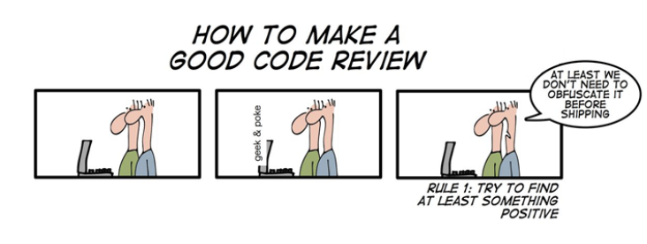

# COMP2100/6442 Group Project | Smart City App

Surprise! (What is a Surprise? See the Group Project Description on Wattle)

**Scenario**: On 10 October 2024, your client carried out an independent code and project review. They are concerned that your team has (a) not made sufficient use of design patterns, (b) not outlined your reasons for selecting a particular software license, and (c) not reviewed the ethical considerations around your app and its development.
<i>Your client sent you the following</i>:
> Your design choices have resulted in an app that, while it may be functional, is not fully modular, reusable, scalable or readable. We are also concerned that you haven’t carefully thought through possible perceived or actual ethical violations, as is standard in industry. And you never consulted us on the software license!

 

While annoyed at your client for not bringing this up earlier, you are incentivised by their promise to fine you 3 marks if you fail to:
- (i) identify **<u>at least one existing</u>** code component that could be replaced by a design pattern—list all relevant git commits, files and line numbers (and provide links) from **before 10 October**;
- (ii) correct **<u>at least one existing</u>** of the implementation issues identified in (i)—list all relevant git commits, files and line numbers (and provide links) from **on or after 10 October**, and explain why the previous solution was not suitable and how you solved the issue;
- (iii) select a software license and explain why you chose this one (4 sentences maximum); and
- (iv) identify and explain **at least one** ethical issue arising from the development or deployment of your app (6 sentences maximum)—you may refer to the IEEE Computer Society Code of Ethics for ideas about potential ethical considerations.

<i>While it is unlikely to occur, you can claim that your code already implements all relevant design patterns and justify why, for parts (i) and (ii).</i>

> - This feature may only correct existing code components committed up to 23:59 on 9 October 2024.
> - All items must be provided and justified in your report to be eligible for the marks.
> - If the link to the relevant part of the code is broken OR does not sufficiently/precisely support your completion of a task/sub-part, you will lose all marks for that sub-part.
> - Improving your code may also help you get more marks for your group assignment.
> - A project without minimum reasonable progress will not be considered for the surprise feature. It is expected that by 10 October, the project will have at least 4 out of the 5 basic features specified in the group assignment completed.

<b>*** Note that any attempt to game the surprise feature may result in an 8 mark penalty out of 30 for the whole group. ***</b>   

### Recommended Reading
[1] IEEE Computer Society. 1999. Code of Ethics. [online] Available at: https://www.computer.org/education/code-of-ethics. [Accessed 7 October 2024].

