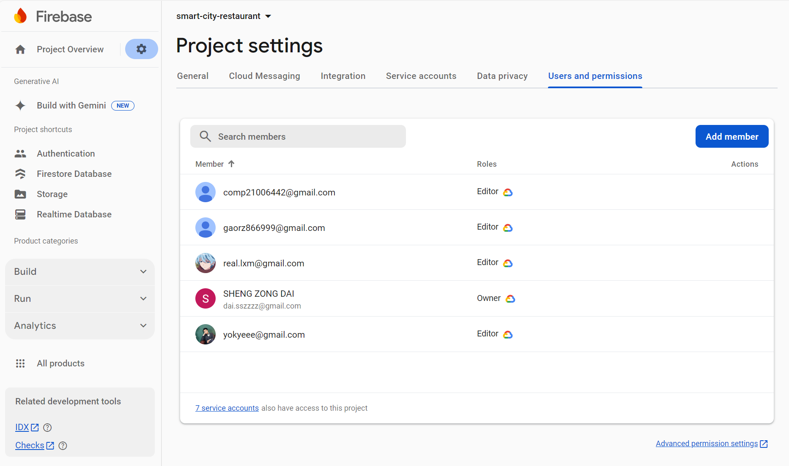

# [G16 - Five Coders] Report

The following is a report template to help your team successfully provide all the details necessary for your report in a structured and organised manner. Please give a straightforward and concise report that best demonstrates your project. Note that a good report will give a better impression of your project to the reviewers.

Note that you should have removed ALL TEMPLATE/INSTRUCTION textes in your submission (like the current sentence), otherwise it hampers the professionality in your documentation.

*Here are some tips to write a good report:*

* `Bullet points` are allowed and strongly encouraged for this report. Try to summarise and list the highlights of your project (rather than give long paragraphs).*

* *Try to create `diagrams` for parts that could greatly benefit from it.*

* *Try to make your report `well structured`, which is easier for the reviewers to capture the necessary information.*

*We give instructions enclosed in square brackets [...] and examples for each sections to demonstrate what are expected for your project report. Note that they only provide part of the skeleton and your description should be more content-rich. Quick references about markdown by [CommonMark](https://commonmark.org/help/)*

## Table of Contents

1. [Team Members and Roles](#team-members-and-roles)
2. [Summary of Individual Contributions](#summary-of-individual-contributions)
3. [Application Description](#application-description)
4. [Application UML](#application-uml)
5. [Application Design and Decisions](#application-design-and-decisions)
6. [Summary of Known Errors and Bugs](#summary-of-known-errors-and-bugs)
7. [Testing Summary](#testing-summary)
8. [Implemented Features](#implemented-features)
9. [Team Meetings](#team-meetings)
10. [Conflict Resolution Protocol](#conflict-resolution-protocol)

## Administrative

*Instruction: please place the CORRECT link to your firebase repository here (with comp21006442@gmail.com added as an Editor)*

- Firebase Repository Link:  https://console.firebase.google.com/project/smart-city-restaurant/overview?hl=zh-cn // TODO

  - Confirm: [X] I have already added comp21006442@gmail.com as a Editor to the Firebase project prior to due date.
  - 

- Two user accounts for markers' access are usable on the app's APK (do not change the username and password unless there are exceptional circumstances. Note that they are not real e-mail addresses in use):

  - Username: comp2100@anu.edu.au  Password: comp2100 [X] // TODO: check if done
  - Username: comp6442@anu.edu.au  Password: comp6442 [X] // TODO: check if done

## Team Members and Roles

The key area(s) of responsibilities for each member

| UID      |     Name      |      Role |
| :------- | :-----------: | --------: |
| u7841935 |  Rongze Gao   | Developer |
| u7811526 | Shengzong Dai | Leader    |
| u7761758 |   Simon Liu   | Developer |
| u7615711 |  Tianfa Zhu   | Designer  |
| u7810157 |   Yuheng Li   | Developer |

## Summary of Individual Contributions

Specific details of individual contribution of each member to the project.

Each team member is responsible for writing **their own subsection**.

A generic summary will not be acceptable and may result in a significant lose of marks.

*[Summarise the contributions made by each member to the project, e.g. code implementation, code design, UI design, report writing, etc.]*

*[Code Implementation. Which features did you implement? Which classes or methods was each member involved in? Provide an approximate proportion in pecentage of the contribution of each member to the whole code implementation, e.g. 30%.]*

*you should ALSO provide links to the specified classes and/or functions*
Note that the core criteria of contribution is based on `code contribution` (the technical developing of the App).

*Here is an example: (Note that you should remove the entire section (e.g. "others") if it is not applicable)*

1. **u7841935, Rongze Gao**  I have 20% contribution, as follows: <br>
   - **Code Contribution in the final App**

   - Feature:
     - [Data-GPS] - class MapFragment: [MapFragment.java]()
     - [P2P-DM] - class ChatFragment: [ChatFragment.java](), SearchUserActivity: [SearchUserActivity.java](), ChatActivity.java: [ChatActivity.java]()
     - [UXUI]
      
   - Design Pattern 
     - Model-View-Controller (MVC) Pattern 
         - Model class FirebaseUtil: [FirebaseUtil.java](), UserUtil: [UserUtil.java]()
         - View class RecentChatAdapter: [RecentChatAdapter.java](), SearchUserAdapter: [SearchUserAdapter.java](), MessageAdapter: [MessageAdapter.java]()
         - Controller class [P2P-DM] feature classes
     - Singleton Pattern - class MapRestaurantCache: [MapRestaurantCache.java](), UserCache: [UserCache.java]()

  - UI files: [fragment_chat.xml](), [activity_search_user.xml](), [activity_chat.xml](), [recent_chat_view.xml](), [search_user_view.xml](), [message_view.xml]()

  - **Others**: Assisted Data Verification

2. **u7810157, Yuheng Li**  I have 20% contribution, as follows: <br>
   - **Code Contribution in the final App**

     - Features: 
        -[DataFiles] - class: [RES_dataSet]()
        -[DataStream] - class: [CommentActivity](),[CommentAdapter](),[Comment]()
     - Factory Design Pattern -  class CommentFactory: [CommentFactory](),[CommentItem](),[ContentInComment](),[UsernameInComment]()
     - UI files: [res_comment.xml]()
     - (any other contribution in the code, including UI and data files) ... [Student class](../src/path/to/class/Student.java), ..., etc.*, [LanguageTranslator class](../src/path/to/class/LanguageTranslator.java): function1(), function2(), ... <br><br>

   - **Code and App Design** 

     - I purposed following items: design pattern:[Factroy design pattern],Datastructure: [Arraylist]
     - UML design:[User case diagram][Class diagram]<br><br>

   - **Others**: (only if significant and significantly different from an "average contribution") 

     - [Report Writing?] [Slides preparation?]*
     - [You are welcome to provide anything that you consider as a contribution to the project or team.] e.g., APK, setups, firebase* <br><br>
3. **u7811526, Shengzong Dai**  I have 20% contribution, as follows: <br>
- **Code Contribution in the final App**

  - Features:

    - [LogIn] - class LoginActivity: [LoginActivity.java](https://gitlab.cecs.anu.edu.au/comp2100/group-project/ga-23s2/-/blob/main/items/media/_examples/Dummy.java)
    - [LoadShowData] - class ItemListAdapter:  [ItemListAdapter.java](), 
    - [Interact-Follow] - class: MeFragment
    - [[UXUI] - class:

  - Design Pattern: 
  
    - Singleton Pattern -  class User, LikeRestaurant: [getInstance()](https://gitlab.cecs.anu.edu.au/comp2100/group-project/ga-23s2/-/blob/main/items/media/_examples/Dummy.java#L22-43),
    - Observer Pattern -  class LikeRestaurant: line 21 - 66
    - Iterator Pattern -  class RestaurantRepository: [functionOne()](https://gitlab.cecs.anu.edu.au/comp2100/group-project/ga-23s2/-/blob/main/items/media/_examples/Dummy.java#L22-43), [function2()](the-URL)
    - DAO Pattern - package Dao 

  - UI files: [bottom_navi.xml](), [activity_login.xml](), [activity_main.xml](), [fragment_item.xml](), [item_list.xml]()

  - Other: setup firebase

    <br>

- **Code and App Design** 

  - I purposed following items: design pattern: [singleton pattern], [observer pattern], [iterator pattern] and [dao pattern]. Datastructure: [Arraylist]
  - [UI Design. I design the theme color and layout location of the project]* <br><br>

- **Others**: (only if significant and significantly different from an "average contribution") 

  - [setup firebase] <br><br><br><br>

4. **u7615711, Tianfa Zhu**  I have 20% contribution, as follows: <br>
   - **Code Contribution in the final App**

     - Feature [UXUI] - class: [MainActivity.java](https://gitlab.cecs.anu.edu.au/u7810157/gp-24s2/-/blob/dev/SmartCity/app/src/main/java/com/example/smartcity/activity/MainActivity.java?ref_type=heads)
     - Feature [UIFeedback] - [MeFragment.java](https://gitlab.cecs.anu.edu.au/u7810157/gp-24s2/-/blob/dev/SmartCity/app/src/main/java/com/example/smartcity/frontend/fragment/MeFragment.java?ref_type=heads)
     
     - UI files: layout:[fragment_home.xml](https://gitlab.cecs.anu.edu.au/u7810157/gp-24s2/-/blob/dev/SmartCity/app/src/main/res/layout/fragment_home.xml?ref_type=heads),[fragment_map.xml](https://gitlab.cecs.anu.edu.au/u7810157/gp-24s2/-/blob/dev/SmartCity/app/src/main/res/layout/fragment_map.xml?ref_type=heads),[fragment_me.xml](https://gitlab.cecs.anu.edu.au/u7810157/gp-24s2/-/blob/dev/SmartCity/app/src/main/res/layout/fragment_me.xml?ref_type=heads),[comment_item.xml](https://gitlab.cecs.anu.edu.au/u7810157/gp-24s2/-/blob/dev/SmartCity/app/src/main/res/layout/comment_item.xml?ref_type=heads), [rounded_background.xml](https://gitlab.cecs.anu.edu.au/u7810157/gp-24s2/-/blob/dev/SmartCity/app/src/main/res/drawable/rounded_background.xml?ref_type=heads),[button_background.xml](https://gitlab.cecs.anu.edu.au/u7810157/gp-24s2/-/blob/dev/SmartCity/app/src/main/res/drawable/button_background.xml?ref_type=heads); 
     layout(landscape):[fragment_home.xml](https://gitlab.cecs.anu.edu.au/u7810157/gp-24s2/-/blob/dev/SmartCity/app/src/main/res/layout-land/fragment_home.xml?ref_type=heads),[fragment_me.xml](https://gitlab.cecs.anu.edu.au/u7810157/gp-24s2/-/blob/dev/SmartCity/app/src/main/res/layout-land/fragment_me.xml?ref_type=heads),[res_comment.xml](https://gitlab.cecs.anu.edu.au/u7810157/gp-24s2/-/blob/dev/SmartCity/app/src/main/res/layout-land/res_comment.xml?ref_type=heads).
     

   - **Code and App Design** 

     - [UI Design. I adopted a clean and clear design language, using a top bar and bottom navigation bar across almost all pages. Furthermore, I ensured a consistent color scheme for the top bar, navigation bar, and buttons.]* <br><br>

## Application Description

*CityTastes is a food lovers' social media app. In this regard, the app will give users the capabilities of searching for restaurants quite conveniently. They are allowed to look for a restaurant by typing down the name or using GPS by pinning their location in order to view the nearby restaurants and save their favorite restaurants by categorizing them. This will let people share reviews, have discussions, and converse with friends in regard to dining out.*

### Problem Statement

*[Our app helps users discoveries of new restaurants by searching either via name or GPS, reading of reviews, saving favorites, and finally sharing in the vibrant community of food enthusiasts.]*

### Application Use Cases and/or Examples

*[Provide use cases and examples of people using your application. Who are the target users of your application? How do the users use your application?]*
<br>
*Here is a pet training application example*

*Jay is looking for a new Italian restaurant in his vicinity to try for dinner.*

1. *Jay opens the app and goes to the home screen, which has listings of popular restaurants in the vicinity.*
2. *He types "Chinese restaurant" in the search feature and views the results returned.*
3. *Then, he identifies a restaurant, reads through the reviews, checks the menu, and decides on it.*
4. *He was eager to dine at this restaurant and shared his experience by posting his review and rating in the application.*
5. *His friend Mark used the application as well and read Jay's review, then he wanted to go to that same restaurant based on his friend Jay's recommendation.*
6. *Later on, Mark visited the restaurant, had an exceptional meal, and posted his review, starting a conversation about their experiences.*

*Targets Users: Food enthusiasts, travelers, and anyone looking to discover new dining options*

* *Users can search for restaurants nearby based on their preferences and dietary needs.*
* *Users can bookmark  their favorite restaurants to make access easier next time*

*Users can share experiences about their dining and reviews with their friends and the community of the app*

*Users can filter restaurants depending on the kind of cuisine they want, the range of pricing, and rating done by users to get the best for their needs*
<hr>

### Application UML

[Whole ClassDiagram](items/uml_Diagram/classDiagram.svg)<br>
<br>
<br>
<br>
<br>
<br>
<hr>

## Code Design and Decisions

This is an important section of your report and should include all technical decisions made. Well-written justifications will increase your marks for both the report as well as for the relevant parts (e.g., data structure). This includes, for example,

- Details about the parser (describe the formal grammar and language used)
- Decisions made (e.g., explain why you chose one or another data structure, why you used a specific data model, etc.)
- Details about the design patterns used (where in the code, justification of the choice, etc)

*Please give clear and concise descriptions for each subsections of this part. It would be better to list all the concrete items for each subsection and give no more than `5` concise, crucial reasons of your design.

<hr>


### Data Structures

*[What data structures did your team utilise? Where and why?]*

Here is a partial (short) example for the subsection `Data Structures`:*

*I used the following data structures in my project:*

1. *AvlTree*
   * ***Objective**: Used for storing restaurant data in a balanced search tree for the search feature. The AVL tree ensures efficient lookups, insertions, and deletions, enabling the application to quickly retrieve restaurant information based on user queries.*
   * **Code Locations**: Defined in [AvlTree.java](https://gitlab.cecs.anu.edu.au/u7810157/gp-24s2/-/blob/dev/SmartCity/app/src/main/java/com/example/smartcity/dataStructure/AvlTree.java?ref_type=heads), and initialized in [AvlTreeManager.java](https://gitlab.cecs.anu.edu.au/u7810157/gp-24s2/-/blob/dev/SmartCity/app/src/main/java/com/example/smartcity/dataStructure/AvlTreeManager.java?ref_type=heads).
   * *Reasons:*
     * The AVL tree is self-balancing, ensuring a time complexity of O(log n) for insertions, deletions, and lookups. This makes it more efficient than using an unsorted array or list when handling a large dataset of restaurants.
     * AVL trees are ideal for the restaurant search feature because the balanced nature ensures that no matter how large the dataset grows, search performance remains optimal.
     * We don’t need to access restaurants by index, which would make an array-based structure less suitable. Instead, the tree structure allows for quick retrieval based on comparisons (e.g., restaurant names or locations).
     * For restaurant queries, the tree’s ordering and balancing help provide both exact and suggested results based on user input, particularly when implementing fuzzy matching.

2. ArrayList

   * ***Objective**: Use for storing the restaurants that user liked and grouped these liked restaurants, when users like or unlike restaurants, the related list can update in time.*
   * **Code Locations: ** Defined in [LikeRestaurants.java]() , [ItemFragment.java]()
   * *Reasons*: 
      * ArrayList can dynamically grow, it won't restrict the number of restaurants that user like.
      * ArrayList is sorted in the order in which the elements were added
      * The faster query speed of ArrayList can help users better group their favorite restaurants.

3. ...

<hr>


### Design Patterns

*[What design patterns did your team utilise? Where and why?]*

1. *Model-View-Controller (MVC) Pattern*

   * *Objective: Used to separate the data (Model), the user interface (View), and the control logic (Controller) to enhance maintainability and scalability of the application.*
   * *Code Locations: 
      - Model: defined in [FirebaseUtil.java](), [UserUtil.java]()
      - View: defined in [RecentChatAdapter.java](), [SearchUserAdapter.java](), [MessageAdapter.java]()
      - Controller: defined in [ChatFragment.java](), [SearchUserActivity.java](), [ChatActivity.java]()
   * *Reasons:*
     * Facilitate clear separation of concerns, allowing easier management of changes in one part of the application without affecting others.
     * Promote better organization of code, leading to improved readability and maintainability.


2. *Data Access Object Pattern(DAO)*

     * *Objective: used for storing user's information for [LogIn] feature and initialize restaurants data for [LoadShowData] feature.*
     * *Code Locations: defined in [Class ItemDao](), [ItemDaoImpl]() , [UserDao](), [UserDaoImpl](); processed using [initialItemList]() and [checkUser()]()*
     * *Reasons:*
       *  Hide details of the data storage and the way to access to database
       * DAO can centralize the data access logic of the application to simplify business logic and facilitate data operations.
       * When need to change the data source or modify the data access logic, we can only work on the data layer and do not affect other layers.

    
3. *Singleton Pattern*

     * *Objective: make sure there is only one instance of LikeRestaurant and provide a global access point to access that instance.*
     * *Code Locations: defined in [LikeRestaurant](); processed using [getInstance()]() .*
     * *Reasons:*
       * Only one instance in memory, reducing memory overhead
       * Provide a global access point for easy access to instances, avoiding the problem of repeatedly creating instances in different places.
       * Data can be easily shared between different objects
         ​  
         <br>


4. *Iterator Pattern*

     * *Objective: used for implementing paging function and optimizing loading datas for [LoadShowData] feature.*
     * Code Locations: defined in [Class Container](), [RestaurantRepository](), [RestaurantIterator](); processed using Method [hasNext()]() and [next()]()
     * *Reasons:*
       * Simplify the aggregation class, the class does not need to care about the traversal logic.
       * Implemented paging functionality to speed up data loading


5. *Observer Pattern*

     * *Objective: used for realizing the grouping of restaurant data and real-time data update and display for [Interact-Follow] feature*
     * Code Locations:  defined in [LikeRestaurant](); processed using [getInstance()]() 
     * Reasons:
       * Keep low coupling and high collaboration between objects
       * Ensure that when the status of the restaurant in 'My Favorite' changes, the corresponding list can be updated in time


6. Factory Pattern

   * *Objective: used for .*

   * Code Locations: defined in [Class Factory](https://gitlab.cecs.anu.edu.au/u7810157/gp-24s2/-/blob/dev/SmartCity/app/src/main/java/com/example/smartcity/Factory/CommentFactory.java?ref_type=heads), [CommentItem](),[ContentInComment](),[UsernameInComment](); processed using Method [CommentActivity]()
   * *Reasons:*

       In order to meet the requirements of high-quality code, I decided to use the factory pattern here to generate comment content. By using the factory pattern, the object creation logic can be encapsulated in a factory class instead of directly instantiating the object in the client code. The advantages of doing so are: 1: The programmer who calls the comment object only needs to know whether he needs to call username or comment to create different objects in the comment. 2: High scalability. If someone need to add a new comment object, he/she only need to extend a factory class. 3: The specific implementation of the comment is shielded, and the developer who calls the comment object only cares about the interface he needs.

<hr>


### Parser

### <u>Grammar(s)</u>

The parser's primary function is to validate and correct tokens by comparing them against this list using the Levenshtein distance algorithm.

The parser operates based on a predefined list of **valid tokens** which are imported from item names imported from Firebase.

Production Rules:

```
<Sentence> ::= <Token>+
<Token> ::= <ValidToken>
```

**Advantages of This Design:**

1. **Simplicity:**
   - **Ease of Implementation:** The parser is straightforward to implement and maintain.
   - **Minimal Overhead:** There's no need for complex parsing tables or state machines, which reduces computational overhead.
2. **Flexibility:**
   - **Dynamic Validation:** The list of valid tokens can be easily updated or extended without altering the underlying parsing logic.
   - **Domain Adaptability:** Suitable for applications where the vocabulary is well-defined and can be enumerated.
3. **Error Correction:**
   - **Robustness:** By finding the closest valid token, the parser can correct minor typographical errors, enhancing user experience.

### <u>Tokenizers and Parsers</u>

**Tokenizer (`Tokenizer` Class):**

- **Purpose:** Breaks down input queries into individual tokens based on whitespace.
- **Usage Scenario:** When a user inputs a query or command, the tokenizer processes the raw string to create a manageable list of tokens for further processing.

**Parser (`Parser` Class):**

- **Purpose:** Validates and corrects tokens by comparing them against a list of predefined valid tokens.
- **Usage Scenario:** After tokenization, the parser ensures that each token is recognized and corrects any discrepancies, such as typographical errors, before the tokens are used in the application’s logic.

<hr>


### Others

*[What other design decisions have you made which you feel are relevant? Feel free to separate these into their own subheadings.]*

<br>

<hr>


## Implemented Features

*[What features have you implemented? where, how, and why?]* <br>
*List all features you have completed in their separate categories with their featureId. THe features must be one of the basic/custom features, or an approved feature from Voice Four Feature.*

### Basic Features

1. [LogIn]. Description of the feature ... (easy)

   * Code: LoginActivity, UserDao, UserDaoImple
   * Description of feature: User can use the fixed account to login <br>
   * Description of your implementation: 
      
      We store the user's login information (username and password) in the Firebase's [Firestore database](https://console.firebase.google.com/project/smart-city-restaurant/firestore/databases/-default-/data/~2Fusers~2Fcomp2100), so that when the user logs in, the information stored in the database is compared and verified.  And when the user enters an empty or incorrect account/password, the app will give a corresponding prompt. <br>

2. [DataFiles]. Description of the feature(easy)

   * Code to the Data File: <a href="[SmartCity/app/src/main/assets/RES_dataSet_reordered_one_line_2.json · dev · Yuheng Li / gp-24s2 · GitLab (anu.edu.au)](https://gitlab.cecs.anu.edu.au/u7810157/gp-24s2/-/blob/dev/SmartCity/app/src/main/assets/RES_dataSet_reordered_one_line_2.json?ref_type=heads)">assets</a>
   * Link to the Firebase repo: <a href="[smart-city-restaurant - Realtime Database - 数据 - Firebase 控制台 (google.com)](https://console.firebase.google.com/project/smart-city-restaurant/database/smart-city-restaurant-default-rtdb/data/~2Frestaurants?hl=zh-cn)">firebase</a>
   * Description of your implementation:
   
      I obtained the official open map API interface of Google from the Google Cloud Console, and obtained the restaurant data we needed from Google Maps through the Google API interface. Then I wrote a script program in Python to crawl data through the API interface. This script uses a simple grid method to generate search locations from several major cities in Australia. Each city has about 10 to 30 search locations (depending on the size of the city), with a search radius of 1,000 meters. The search keywords are restaurant, cafe, bar, and the information obtained includes name, image URL, rating, address, latitude and longitude, price level and restaurant category. Finally, the results are saved in JSON format.

3. [LoadShowData]

   * Code: [ItemListAdapter](), [ItemFragment](), [RestaurantRepository]()
   * Description of feature: The app load and display data instances from the data set. <br>
   * Description of your implementation: 
   
      We stored the restaurant data in Firebase's [Realtime Database](https://console.firebase.google.com/project/smart-city-restaurant/database/smart-city-restaurant-default-rtdb/data/~2Frestaurants) because it works well with JSON-formatted data. Additionally, we created a corresponding `Restaurant` class with properties that map directly to the JSON structure, allowing for seamless data reading and display. As we have 3,500 records, we implemented pagination to prevent overloading the system by loading too much data at once. Each page displays 12 records, and users can click "load more data" to view the next set of data. To achieve this, we used the Iterator pattern in the implementation.<br>

4. [DataStream]

   * Code: [CommentActivity](https://gitlab.cecs.anu.edu.au/u7810157/gp-24s2/-/blob/dev/SmartCity/app/src/main/java/com/example/smartcity/activity/CommentActivity.java?ref_type=heads),[CommentAdapter](https://gitlab.cecs.anu.edu.au/u7810157/gp-24s2/-/blob/dev/SmartCity/app/src/main/java/com/example/smartcity/adapter/CommentAdapter.java?ref_type=heads),[CommentFactory](https://gitlab.cecs.anu.edu.au/u7810157/gp-24s2/-/blob/dev/SmartCity/app/src/main/java/com/example/smartcity/Factory/CommentFactory.java?ref_type=heads),[Comment](https://gitlab.cecs.anu.edu.au/u7810157/gp-24s2/-/blob/dev/SmartCity/app/src/main/java/com/example/smartcity/entity/Comment.java?ref_type=heads)
   * Description of feature:Users can click every single restaurant and jump to new page with details and comments. The comment can be generated by system automatically,and user can submit their own comments on it, it excatly simulate the datastream between the users and other users.<br>
   * Description of your implementation:First we need to set click listener on ever item showed in the list, and then we design the new page's [UI](https://gitlab.cecs.anu.edu.au/u7810157/gp-24s2/-/blob/dev/SmartCity/app/src/main/res/layout/res_comment.xml?ref_type=heads#L1) for comment and write a new class `comment` to represent the comments show under the restaurants with factory design pattern. Secondly, we design the activity and adapter for comment page to show the details of certain restaurant and generate the comment normally, we apply `thread` in it and set the time gap as 2~3 seconds. Finally, we designed a lot of contents and usernames for every comment and let them loaded in comment page successfully.<br>

5. [Search]

6. [UXUI]

   - Code: LoginActivity, UserDao, UserDaoImple
   - Description of feature: User  can use the fixed account to login
   - Description of your implementation: Store the users' information in firebase 

7. [UIFeedback]

   - Code: LoginActivity, UserDao, UserDaoImple, MeFragment
   - Description of feature: User can use the fixed account to login, logout 
   - Description of your implementation: After the user enters incorrect information or logs out, the system will display a toast.

   <br>

### Custom Features

Feature Category: Search-related features <br>

  1. `[Search-Invalid]` The search functionality must not only provide results for valid search queries (extension of the basic **[Search]** feature) but also process and correctly handle partially invalid search queries, returning meaningful results. Refer to the [Feature Request Example](#feature-request-example) for further explanation of this feature. (medium)

     * Code: [Class X, methods Z, Y](https://gitlab.cecs.anu.edu.au/comp2100/group-project/ga-23s2/-/blob/main/items/media/_examples/Dummy.java#L22-43) and Class Y, ...

     * Description of your implementation: ... <br>

       <br>

  2. `[Search-Filter]` The app must provide functionality to sort and filter a list of items returned from searches using appropriate UI components. (easy)

     * Code: [Class X, methods Z, Y](https://gitlab.cecs.anu.edu.au/comp2100/group-project/ga-23s2/-/blob/main/items/media/_examples/Dummy.java#L22-43) and Class Y, ...

     * Description of your implementation: ...


Feature Category: Greater Data Usage, Handling and Sophistication <br>

   3. `[Data-GPS]` The app must utilize GPS information based on location data. Hint: see the demo presented by our tutors on ECHO360. (easy). 

      * Code: [MapFragment.java]()

      * Description of your implementation: 
        * Implemented GPS functionality using the Google Maps API to display nearby restaurants based on the user's current location.
        * Loaded restaurant data from a Firebase database and marked them on the map using custom markers, allowing users to tap on markers for more information.

Feature Category: Peer to Peer Messaging <br>


4. `[P2P-DM]` The app must provide users with the ability to send direct, private messages to each other. (hard). 

   * Code: [ChatFragment.java](), [ChatActivity.java](), [SearchUserActivity.java]()

   * Description of your implementation: 
        * Developed a peer-to-peer messaging system that allows users to send and receive direct messages.
        * Utilized Firebase Firestore for real-time data synchronization, enabling messages to be sent instantly and visible to both sender and receiver.
        * Created user search functionality that allows users to find other users by name, facilitating the initiation of chats.
        * Implemented RecyclerViews to display recent chat windows and chat messages, enhancing user experience through efficient data handling and presentation.

  Feature Category: User Interactivity <br>

5. `[Interact-Follow]` The app must provide the ability to follow, save or collect items. There must be a section that displays all items followed, saved or collected by a user, with items grouped and ordered. This information should be stored in-memory. (hard). 

   * Code:

   * Description of your implementation:
 
Feature Category: Firebase Integration <br>

3. [FB-Auth] Description of the feature (easy)

* Code: [Class X, entire file](https://gitlab.cecs.anu.edu.au/comp2100/group-project/ga-23s2/-/blob/main/items/media/_examples/Dummy.java#L22-43) and Class Y, ...
* [Class B](../src/path/to/class/file.java#L30-85): methods A, B, C, lines of code: 30 to 85
* Description of your implementation: ... <br>

<hr>


### Surprise Feature

*Instructions:*

- If implemented, explain how your solution addresses the task (any detail requirements will be released with the surprise feature specifications).

- (i) identify **at least one existing** code component that could be replaced by a design pattern—list all relevant git commits, files and line numbers (and provide links) from **before 10 October**;

  - Relevant git commits:  [Rebuild item_list layout to fit favorite function (22e7bba3) · Commits · Yuheng Li / gp-24s2 · GitLab (anu.edu.au)](https://gitlab.cecs.anu.edu.au/u7810157/gp-24s2/-/commit/22e7bba3ce999c8ebddd5766951aa77f099758a8) , [Implement favorite basic function (7b26f2d9) · Commits · Yuheng Li / gp-24s2 · GitLab (anu.edu.au)](https://gitlab.cecs.anu.edu.au/u7810157/gp-24s2/-/commit/7b26f2d986c1976984fd971f42edb77b6064faa5)  (1 October)
  - Related class: [LikeRestaurant (line 1- line 14)](https://gitlab.cecs.anu.edu.au/u7810157/gp-24s2/-/blob/7b26f2d986c1976984fd971f42edb77b6064faa5/SmartCity/app/src/main/java/com/example/smartcity/entity/LikeRestaurant.java#L1-14) , [MeFragment (line 32 - line 34)](https://gitlab.cecs.anu.edu.au/u7810157/gp-24s2/-/blob/7b26f2d986c1976984fd971f42edb77b6064faa5/SmartCity/app/src/main/java/com/example/smartcity/fragment/MeFragment.java#L32-34) .

- (ii) correct **at least one existing** of the implementation issues identified in (i)—list all relevant git commits, files and line numbers (and provide links) from **on or after 10 October**, and explain why the previous solution was not suitable and how you solved the issue;

  - Relevant git commits: [Optimise 'Me' page my favorite part (1a237d78) · Commits · Yuheng Li / gp-24s2 · GitLab (anu.edu.au)](https://gitlab.cecs.anu.edu.au/u7810157/gp-24s2/-/commit/1a237d78a22835ea8d949a033561659247e75236), [Fix the wrong display of restaurant type (ae7e3ec9) · Commits · Yuheng Li / gp-24s2 · GitLab (anu.edu.au)](https://gitlab.cecs.anu.edu.au/u7810157/gp-24s2/-/commit/ae7e3ec9494fa546f2377743d6e8eb75526cf7b6)

  - Relevant files:

    - Changed: [MeFragment.java (line 56 - line 60)](https://gitlab.cecs.anu.edu.au/u7810157/gp-24s2/-/blob/ae7e3ec9494fa546f2377743d6e8eb75526cf7b6/SmartCity/app/src/main/java/com/example/smartcity/fragment/MeFragment.java#L56-60)

    - Expand: [LikeRestaurant (line 10 - line 65)](https://gitlab.cecs.anu.edu.au/u7810157/gp-24s2/-/blob/ae7e3ec9494fa546f2377743d6e8eb75526cf7b6/SmartCity/app/src/main/java/com/example/smartcity/observer/LikeRestaurant.java#L10-65), [LikeRestaurantObserver (line 1 - line 6)](https://gitlab.cecs.anu.edu.au/u7810157/gp-24s2/-/blob/ae7e3ec9494fa546f2377743d6e8eb75526cf7b6/SmartCity/app/src/main/java/com/example/smartcity/observer/LikeRestaurantObserver.java#L1-6), [Subject (line1 - line9)](https://gitlab.cecs.anu.edu.au/u7810157/gp-24s2/-/blob/ae7e3ec9494fa546f2377743d6e8eb75526cf7b6/SmartCity/app/src/main/java/com/example/smartcity/observer/Subject.java#L1-9), [MeFragment (line 64 - line 82)](https://gitlab.cecs.anu.edu.au/u7810157/gp-24s2/-/blob/ae7e3ec9494fa546f2377743d6e8eb75526cf7b6/SmartCity/app/src/main/java/com/example/smartcity/fragment/MeFragment.java#L64-82), [MeFragment (line 94 - line118)](https://gitlab.cecs.anu.edu.au/u7810157/gp-24s2/-/blob/ae7e3ec9494fa546f2377743d6e8eb75526cf7b6/SmartCity/app/src/main/java/com/example/smartcity/fragment/MeFragment.java#L94-118)

    - Why the previous solution was not suitable: 

      In the old version, if the user click the "like" button to like  restaurant on the item page, then it appeared in the "My Favorites" section of the me page. If the user clicked on the "like" button again-to unlike-the restaurant instantly disappeared from the favorites list. I did this by using the Singleton pattern to create the class `LikeRestaurant`, which extended the `ArrayList<Restaurant>` and acted as a global variable, which stored the user's selections in memory. Then, the `ItemAdapter` was set to listen for that instance; thus, when the user liked a restaurant on an item page, it showed up in "My Favorites." Similarly, unliking it immediately removed it from the list.

      However, when the 'grouped' feature was introduced, the previous code couldn't support real-time updates when restaurants were grouped by type. ⁤⁤This is because `ItemAdapter` only listened to `LikeRestaurant`, while the grouping functionality used another list, `filterList` (used to store the filtered restaurants). ⁤⁤When the user grouped restaurants in "My Favorites," `filterList` was updated based on the types in `LikeRestaurant`, but the display didn't update immediately when a restaurant was unliked. ⁤⁤Even though the restaurant was removed from `LikeRestaurant`, it still persisted in `filterList` (The 'like' button is canceled display), since `ItemAdapter` wasn't listening to it. 

    - How to solve the issue: 

      The essence here is ensuring that `filterList` updates in real-time whenever `likeRestaurant` is modified. This scenario is a perfect fit for the Observer pattern. In this case, `likeRestaurant` would act as the subject, and `MeFragment` (though implemented in `filterList`) would be the observer. When the state of `likeRestaurant` changesᅳsuch as when a user likes or unlikes a restaurantᅳthe add() or remove() methods are triggered, and the observer is notified. This, in turn, calls `filterRestaurantsByType` to update the state of `filterList`. By applying the Observer pattern, when user unlike the restaurant on 'Me' page, the state of `likeRestaurant` changed, and notified current `filterList`, the update the state of `filterList`, thus implemented the real-time updates of the list.

- (iii) select a software license and explain why you chose this one (4 sentences maximum);<br>
 **The license we choose:** MIT License<br>
 **The reason:** We choose the MIT LICENSE since it has wide usage, allowing modification and distribution, and the source code of an app remains open-source. It highly encourages collaboration, hence further development. Secondly, it limits liability and warranty, protecting the developers(us). Since the app will likely evolve and will be integrated in many other systems, the MIT License makes this flexible.

- (iv) identify and explain **at least one** ethical issue arising from the development or deployment of your app (6 sentences maximum)—you may refer to the IEEE Computer Society Code of Ethics for ideas about potential ethical considerations.<br>
**The ethical issues we may need to attention:** User privacy<br>
**The reason:** One ethical issue in the development or deployment of the app is user privacy, particularly in how location and personal data are collected and stored. If users' data, such as their search history or chat list, is not properly secured or anonymized, it could be misused, leading to privacy violations. According to the IEEE Code of Ethics, developers have a duty to protect users' data and ensure that their systems do not cause harm. It is crucial to inform users about how their data is used and to gain proper consent. Failure to do so would undermine trust and could lead to ethical breaches.

<br> <hr>

## Testing Summary

*[What features have you tested? What is your testing coverage?]*
*Please provide details (see rubrics) including some screenshots of your testing summary, showing the achieved testing coverage. Feel free to provide further details on your tests.*

*Here is an example:*

1. Tests for Search

   - Code: [TokenizerTest Class, entire file](https://gitlab.cecs.anu.edu.au/comp2100/group-project/ga-23s2/-/blob/main/items/media/_examples/Dummy.java) for the [Tokenizer Class, entire file](https://gitlab.cecs.anu.edu.au/comp2100/group-project/ga-23s2/-/blob/main/items/media/_examples/Dummy.java#L22-43)
   - *Number of test cases: ...*
   - *Code coverage: ...*
   - *Types of tests created and descriptions: ...*

2. Tests for Iterator

    - Code: [IteraotrTest Class]() for the [RestaurantRepository Class]()
    - *Number of test cases: 2*
    - *Code coverage: *
    - *Types of tests created and descriptions:*
        1. testLoadPageData():
          - Simulate an AVLTree that inserts data
          - Validate correct loading of paginated data from the AVL tree.
          - Verify that the iterator can correctly load the paginated data
          - Ensure that each page contains the correct number (12)
          - Ensure the next page with data can load successfully
        
        2. testLoadExcessiveData():
          - Ensure that the iterator correctly identifies when there is no more data to return.
...

<br> <hr>

## Summary of Known Errors and Bugs

*[Where are the known errors and bugs? What consequences might they lead to?]*
*List all the known errors and bugs here. If we find bugs/errors that your team does not know of, it shows that your testing is not thorough.*

*Here is an example:*

1. *Bug 1:*

   - Description: When users are in the process of searching for users or chatting with other users, pressing the phone's built-in back navigation key causes the application to crash or logs out the current user.
   - Steps to Reproduce:
       - Open the application.
       - Navigate to the user search or chat feature.
       - Press the back navigation key on the phone.

2. *Bug 2:*

   - Description: When the emulator is launched for the first time and the map interface is accessed, the map displays at the default location (Los Angeles) instead of the set current location (ANU's CSIT building), despite the emulator's default location being configured correctly. Users need to manually click the location button to update to the correct position.
   - Steps to Reproduce:
       - Launch the emulator.
       - Open the application.
       - Navigate to the map feature.
       - Observe that the map shows the default location instead of the configured location.
3. ...

<br> <hr>

## Team Management

### Meeting Minutes

* Link to the minutes of your meetings like above. There must be at least 4 team meetings.
  (each committed within 2 days after the meeting)
* Your meetings should also have a reasonable date spanning across Week 6 to 11.*

  - *[Team Meeting 1](link_to_md_file.md)*
  - *[Team Meeting 2](link_to_md_file.md)*
  - *[Team Meeting 3](link_to_md_file.md)*
  - *[Team Meeting 4](link_to_md_file.md)*
  - *[Team Meeting 5](link_to_md_file.md)*
- ... (Add any descriptions if needed) ...

<hr>

### Conflict Resolution Protocol

*[Write a well defined protocol your team can use to handle conflicts. That is, if your group has problems, what is the procedure for reaching consensus or solving a problem?
(If you choose to make this an external document, link to it here)]*

*If your group has issues, how will your group reach consensus or solve the problem?*
*- e.g., if a member gets sick, what is the solution? Alternatively, what is your plan to mitigate the impact of unforeseen incidents for this 6-to-8-week project?*

This shall include an agreed procedure for situations including (but not limited to):

- A member is sick in the final week of the project.
- A member didn't complete the assigned task which should've been completed before the checkpoint, and the checkpoint is approaching.
- A member is unreachable (didn't respond messages in your agreed communication channels and emails in two days).
- The team have different understandings toward the requirement of the assignment.